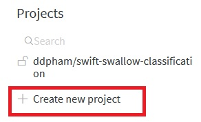
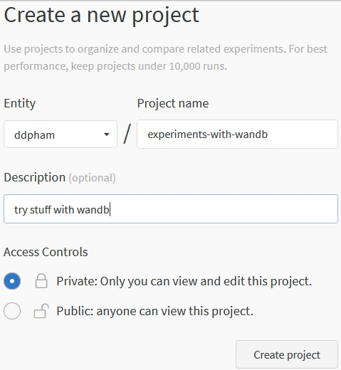
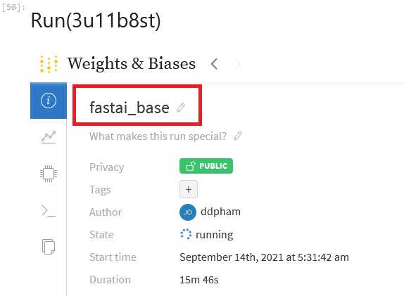
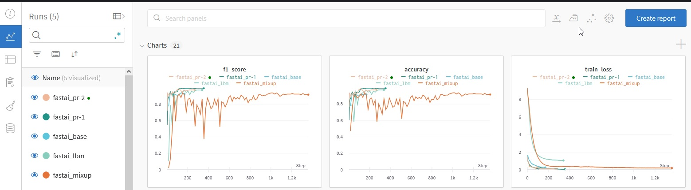
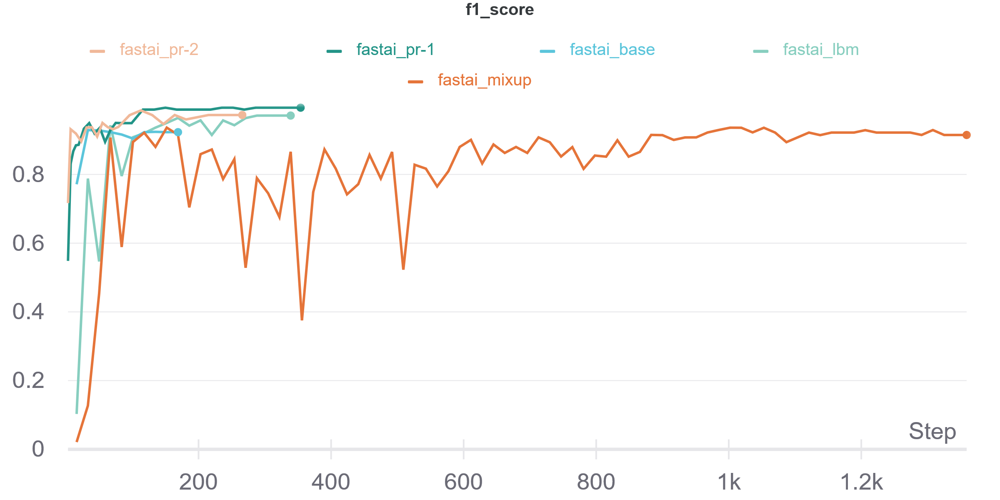
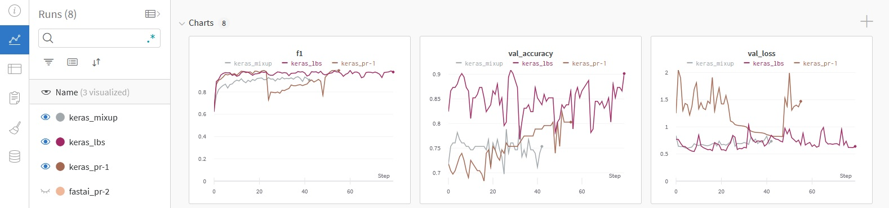

# wandb-experiments
experiments with Weights and Biases

# Tạo tài khoản và project
> Trước khi bắt đầu với Weights & Biases, chúng ta cần tạo tài khoản và tạo project trên [https://wandb.ai](https://wandb.ai)
> 
> SignUp tài khoản.
> 
> Tạo 1 project mới:


> Sau đó tạo tên cho project:


Ở đây tôi đã tạo sẵn 1 project cho [repository này](https://docs.wandb.ai/guides/integrations)


# Cách sử dụng
> Ở đây tôi chỉ đề cập đến 2 framework chính là `fastai` và `keras/tensorflow`. W&B còn có với các framework khác như `scikit-learn`, `xgboost`, `lightgbm`, `pytorch`, `huggingface` và có cách log chung cho bất kỳ loại framework nào. Chi tiết xem ở đây [wandb-integrations](https://docs.wandb.ai/guides/integrations)

## fastai
Sau khi đã tạo xong project, trước khi bắt đầu các model, bạn sẽ cần khởi tạo việc log lại model thông qua phương pháp sau:

```python
import wandb
from fastai.callback.wandb import *

wandb.init(project='Tên project bạn đã tạo', entity='user_name của bạn')
```
Nếu bạn init lần đầu, wandb sẽ yêu cầu bạn cung cấp token theo link, bạn chỉ cần ấn vào link, login, copy token và paste vào jupyter notebook là được.
Sau đó, bạn sẽ thấy màn hình của session (run) của bạn. Bạn có thể thay đổi  tên của session:




Với model của bạn, bạn có 2 cách để log model với `WandbCallback`:
1. Log với callback là của learner, như vậy toàn bộ các bước khi bạn thực hiện vs learner sẽ được log lại (bao gồm cả `lr_find` nếu bạn sử dụng):
```python
# Log với learner:
learner = cnn_learner(dls, resnet50, pretrained=True,
                      loss_func=CrossEntropyLossFlat(), 
                      metrics=[accuracy, F1Score()], 
                      cbs=[WandbCallback(), SaveModelCallback()])
```

2. Log với `fit`/`fit_one_cycle` của learner khi bạn bắt đầu train model:
```python
learner = cnn_learner(dls, resnet50, pretrained=True, loss_func=CrossEntropyLossFlat(), metrics=[accuracy, F1Score()])
lr_valley = learner.lr_find()
learner.fit_one_cycle(epochs=10, max_lr=lr_valley, cbs=[WandbCallback(), SaveModelCallback()])
```

Để kết thúc với session cả mình:
```python
wandb.finish()
```
Câu lệnh này sẽ mất 1 chút thời gian để hoàn thành, sau đó, bạn sẽ thấy kết quả tổng hợp lại các chỉ số của model. Bạn có thể stop kernel cho phần này nếu thấy không cần thiết

Sau cùng, bạn có thể thấy kết quả ntn trên web



Chúng ta có thể dễ dàng so sánh kết quả các metrics giữa các model để đánh giá mức độ hiệu quả của chúng:



Bạn có thể xem chi tiết với [wandb-experiments-with-fastai.ipynb](https://github.com/ddpham/wandb-experiments/blob/main/nbs/wandb-experiments-with-fastai.ipynb)

## keras

```python
from wandb.keras import WandbCallback
```

Trước khi bắt đầu với wandb, chúng ta cần login, trên Jupyter Notebook:
```python
!wandb login
```
Sau khi bạn đã login vs wandb rồi thì các biết tiếp sẽ tương đồng với fastai. Để khởi động session (run), bạn `init` project bạn đã tạo:

```python
PROJECT_NAME = 'Tên project của bạn'
PROJECT_ENTITY = 'username của bạn'
wandb.init(project=PROJECT_NAME, entity=PROJECT_ENTITY)
```
Tất nhiên bạn có thể sử dụng thêm argument config để config các hyperparameters mà bạn mong muốn theo cách của bạn (learning_rate, epochs...). Ở đây, mình ko đề cập đến config vì bản thân cần làm tương đối nhiều thứ chi tiết với các hyper parameters này mà chỉ muốn wandb log lại các giá trị này thôi.

Với keras, bạn bổ sung `WandbCallback()` vào `callbacks` khi `fit` là được:
```python
model.fit(train_ds, epochs=epochs, validation_data=valid_ds, callbacks=[WandbCallback()])
```

**Lưu ý**: Khác với fastai, chúng ta ko có thêm `SaveModelCallback()` để lưu lại model tốt nhất.

Khi đã chạy xong thử nghiệm với model nào, bạn cần finish callback:
```python
wandb.finish()
```
Chỉ đơn giản có vậy thôi.
Kết quả bạn nhận được sẽ tương tự như sau:



Bạn có thể xem chi tiết với [wandb-experiments-with-keras.ipynb](https://github.com/ddpham/wandb-experiments/blob/main/nbs/wandb-experiments-with-keras.ipynb)

Kết quả toàn bộ các model được log lại trên server của wandb, bạn có thể xem tại đây [wandb: swift-swallow-classification](https://wandb.ai/ddpham/swift-swallow-classification)
